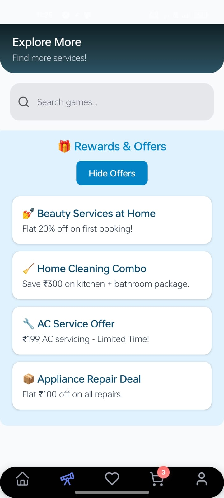
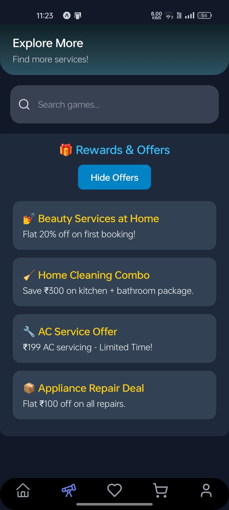

# 🛠️ Home Service Booking App (React Native + Expo)

A sleek, modular **React Native app** built using **Expo** for booking home services like AC repair, salon, plumbing, fitness trainers, and more.

> 📅 Last Updated: June 24, 2025

---

## 🚀 Features

- 🎨 Onboarding Splash + Auth Flow  
- 🔐 Login / Signup with Formik + Yup Validation + Password checks  
- 🌗 Persistent Dark/Light Mode (AsyncStorage + ThemeContext)  
- 📱 Modern UI for Home, Services, Explore, Rewards, Games, Bookings  
- 💳 Cart, Quantity Update, Checkout Flow, Order Confirmation  
- ✅ Booking Status: Done, Cancel, Track  
- 👤 Profile page with photo upload, crop and settings panel  
- 🎮 Extra Features: Explore Games like Chess and Tic Tac Toe  
- 🔔 Settings: Toggle Dark Mode, Notifications, and App Info  

---

## 🧩 Tech Stack

| Tool/Library            | Purpose                              |
|-------------------------|--------------------------------------|
| `React Native`          | Mobile development framework         |
| `Expo`                  | App bundling, splash, assets         |
| `Formik` + `Yup`        | Form handling + validation           |
| `AsyncStorage`          | Data persistence (auth, theme, etc.) |
| `React Navigation`      | Drawer, Stack, Bottom Tabs           |
| `Lucide Icons`          | UI icon set                          |
| `expo-linear-gradient`  | Background gradients for headers     |
| `Axios`                 | Dummy API handling and mocks         |

---

## 📸 Screenshots

> Screenshots stored in `screenshots/` folder in project root.

  
  
  
  
  
  
  
  
  
  
  
  
  
  
  
  
  
  
  
  
  
  
  
  
  
  
  
  
  
  
  
  
  
  
  
  
  

---

## 🗂️ Project Structure (Simplified)

# 🛠️ Home Service Booking App – *Project: Eaxier*

> Developed by **Team Byte Empires**  
> A sleek and modular React Native app to simplify your daily service bookings!

---

## 🧠 Motive

This project is aimed at providing an all-in-one demo of a real-world **Home Service Booking App** that simulates:

- 🔐 User authentication and persistent session storage  
- 🔍 Category-wise service discovery and filtering  
- 🛒 Add to cart, quantity management, checkout, and order tracking  
- 🎮 Extra features like mini-games and reward systems  
- 🌗 Light/Dark mode toggle with persistent theme  
- 🎨 Clean, modern UI with reusable components  

---

## 🛠️ Setup Instructions

1. Clone this repo  
2. Run `npm install`  
3. Start with `npx expo start`  

Make sure these dependencies are installed:

- `@react-native-async-storage/async-storage`  
- `formik` + `yup`  
- `expo-linear-gradient`  
- `react-navigation`  
- `axios`  
- `lucide-react-native`  

---

## 👥 Contributors

**Team Byte Empires – Project: Eaxier**

1. Nishit Ram – `23BCSD30`  
2. Pankaj Ghosh – `23BCSE33`  
3. Swayam Subham Mishra – `24BCSL18`

---

This project is created purely for **educational and demo purposes and for our final project presentation**. Not intended for commercial deployment.

**Thank You**

